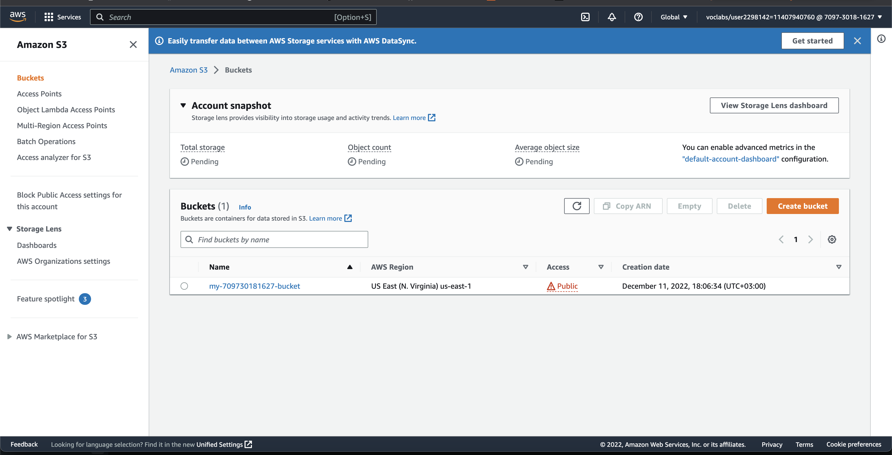
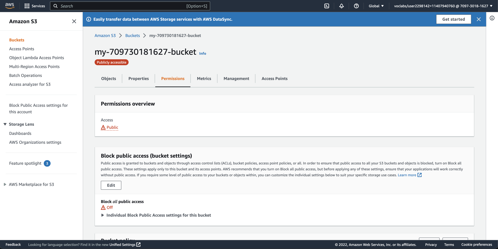
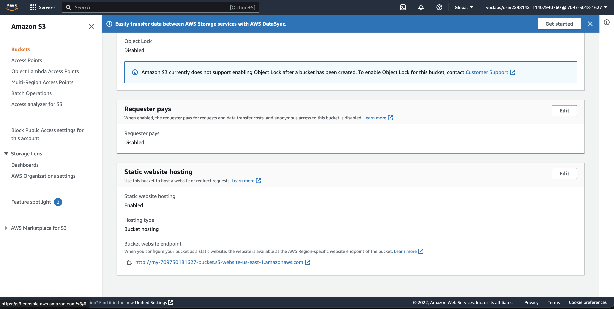
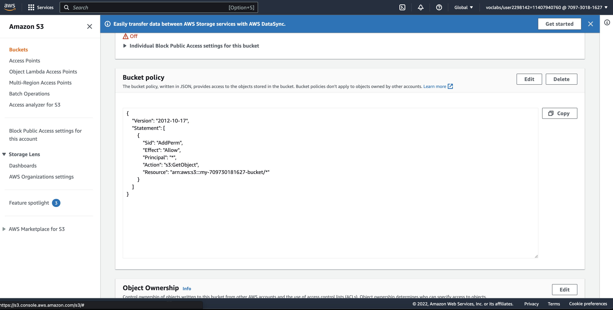
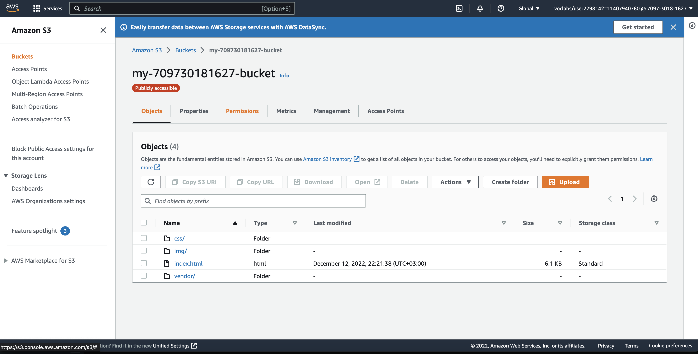
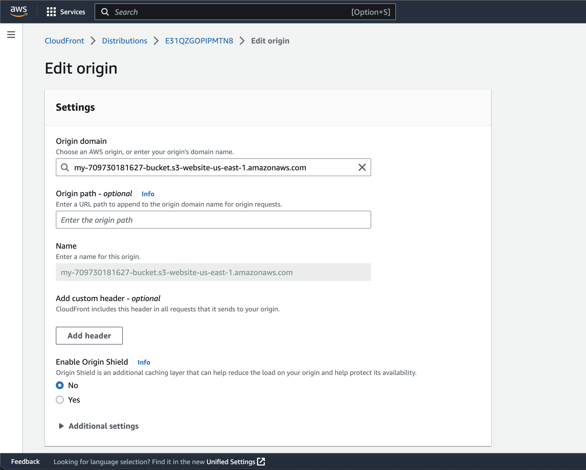
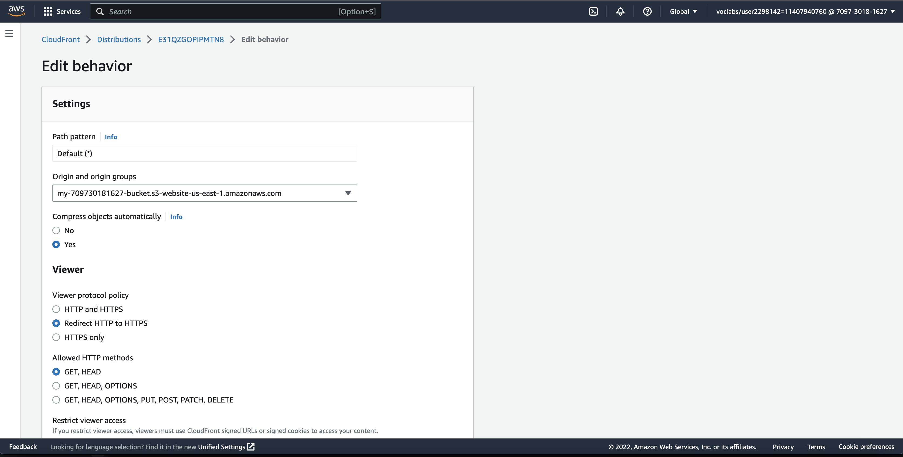
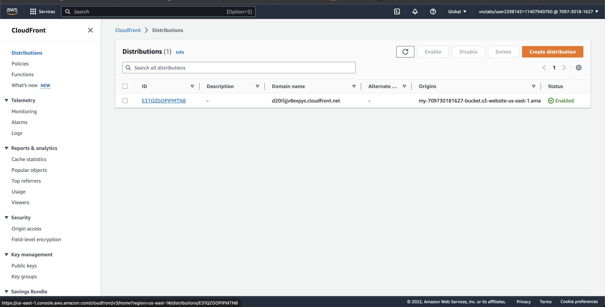

# Udacity DevOps Engineer Project one 

## Deploy a static Website to AWS S3 Bucket and Using CLoudFront
The website is accessible on the link d20i5jjv8expys.cloudfront.net

### S3 Bucket Configurations.
#### The bucket was given a unique global name my-709730181627-bucket as seen below.

#### The bucket has also been configured to have public acce and also turned on the static website hositing.

#### The bucket policy was update with the provide policy document in json

#### After configuring the s3 bucket. I did upload the website files as seen below.

### CloudFront Configuration.
#### I created the distribution under cloudFront and below are the configuration details.

#### The static website hosting on S3 bucket returned an endpoint which i copied and used as the origin domain while creating the distribution as seen below.

#### I did enforce http to redirect to https hence the website having an ssl certificate. The configuration is as below.

#### On successfully creating the distribution was deployed wiith a domain name link for accessing the website as seen below.

#### On clicking the link d20i5jjv8expys.cloudfront.net the website is loaded as below.
